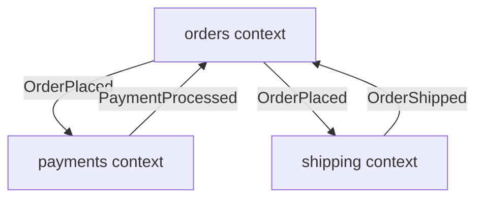

# Vertical Slice Architecture (VSA) Manager

A Rust-based CLI tool and VS Code extension for enforcing Vertical Slice Architecture with bounded contexts, integration events, and event sourcing patterns.

## 🎯 What is VSA?

**Vertical Slice Architecture** organizes code by business features rather than technical layers. Each "slice" contains everything needed for that feature - from API to database.

**Benefits:**
- ✅ Features are self-contained and easy to understand
- ✅ Teams can work in parallel without conflicts
- ✅ Changes are localized to a single slice
- ✅ Easy to test and maintain
- ✅ **Now supports Python!** 🐍

## 🏛️ The VSA Standard

This tool enforces a **rigorous architectural standard** combining:
- **Vertical Slice Architecture** - Feature-first organization
- **Hexagonal Architecture (Ports & Adapters)** - Clean dependency boundaries
- **Domain-Driven Design** - Bounded contexts, aggregates, events, commands
- **Event Sourcing** - Immutable events as the source of truth

### Architecture Decision Records

The VSA standard is formally documented in ADRs:
- **[ADR-019: VSA Standard Structure](../../docs/adrs/ADR-019-vsa-standard-structure.md)** - Canonical structure and naming conventions
- **[ADR-005: Event Store Integration](../../docs/adrs/ADR-005-event-store-integration.md)** - Event sourcing patterns
- **[ADR-006: Hook Architecture](../../docs/adrs/ADR-006-hook-architecture-agent-swarms.md)** - Cross-context communication
- **[ADR-008: VSA Projection Architecture](../../docs/adrs/ADR-008-vsa-projection-architecture.md)** - Read model patterns

### What the Validator Enforces

The VSA validator implements **30+ architectural rules** across 6 categories:

#### 1. Structure Rules (VSA001-VSA026)
- ✅ Bounded contexts have required folders (`domain/`, `slices/`, `_shared/`)
- ✅ Events in `domain/events/` (events ARE domain language)
- ✅ Commands in `domain/commands/`
- ✅ Aggregates in `domain/` root (high visibility)
- ✅ Ports at context root (not under domain/)
- ✅ Naming conventions enforced (`*Event`, `*Command`, `*Aggregate`, `*Port`)

#### 2. Dependency Rules (VSA027-VSA031)
- ✅ **Domain purity** - No external dependencies, only pure business logic
- ✅ **Events isolation** - Pure data structures (stdlib + value objects only)
- ✅ **Port isolation** - Only import from domain layer
- ✅ **Application isolation** - No direct slice dependencies
- ✅ **Slice isolation** - No cross-slice imports (use events)

#### 3. Event Sourcing Rules
- ✅ Aggregates apply events correctly
- ✅ Event versioning patterns
- ✅ No state mutations outside event handlers

#### 4. Slice Rules
- ✅ Each slice has required components (commands, events, handlers)
- ✅ Test files present and properly named
- ✅ Slice boundaries respected

#### 5. Query/Projection Rules
- ✅ Read models separated from write models (CQRS)
- ✅ Projections subscribe to correct events
- ✅ No business logic in projections

**Event Handler Conventions:**

The scanner detects event handlers and external entry points via naming patterns:

| Pattern | Purpose | Example |
|---------|---------|---------|
| `on_<event>` | **Internal domain events** - Primary pattern for aggregates and projections (treated as domain event subscriptions) | `on_order_placed`, `on_session_started` |
| `handle_<event>` | **External/ACL events** - Anti-Corruption Layer for webhooks and external integrations (treated as external entry points, not domain event subscriptions) | `handle_app_installed` (GitHub webhook) |

> **Note:** `handle_<event>` is typically used at integration boundaries (e.g., webhook handlers) where external events are translated into internal domain concepts. These are external entry points, not internal domain event subscriptions.

#### 6. Integration Event Rules
- ✅ Cross-context events in `_shared/integration-events/`
- ✅ Single source of truth
- ✅ Proper publisher/subscriber declarations

---

## 🏗️ Bounded Context & Aggregate Convention (ADR-020)

> **New in v0.7+**: Clear conventions for organizing aggregates within bounded contexts.

### The Key Principle

> **Multiple aggregates CAN and SHOULD live in ONE bounded context when they share the same domain language.**

A bounded context is a **semantic boundary** (shared language), NOT a 1:1 mapping with aggregates.
An aggregate is a **consistency boundary** (atomic changes).

### The `aggregate_<name>/` Folder Convention

Each aggregate lives in its own folder within `domain/`:

```
context/domain/
├── aggregate_execution/                    # All sort together alphabetically
│   ├── WorkflowExecutionAggregate.py       # THE root (full name, NOT generic!)
│   ├── PhaseExecution.py                   # Entity (has identity)
│   └── ExecutionStatus.py                  # Value Object (immutable)
│
├── aggregate_workflow/
│   ├── WorkflowAggregate.py                # THE root
│   └── PhaseDefinition.py                  # Value Object
│
├── aggregate_workspace/
│   ├── WorkspaceAggregate.py               # THE root
│   ├── IsolationHandle.py                  # Entity
│   └── SecurityPolicy.py                   # Value Object
│
├── commands/                               # Commands (sorted after aggregate_*)
├── events/                                 # Events
└── _shared/                                # Shared VOs across aggregates
```

### Why This Convention?

| Feature | Benefit |
|---------|---------|
| `aggregate_` prefix | All aggregate folders sort together at top |
| Full file names | Editor tabs show `WorkspaceAggregate.py` not generic `aggregate.py` |
| One root per folder | Enforces consistency boundary |
| Co-located entities/VOs | Clear ownership, no orphans |

### Convention Rules

1. **Folder name:** `aggregate_<name>/` (lowercase, snake_case)
2. **Root file:** `<Name>Aggregate.py` (PascalCase, FULL name)
3. **One root only:** Only ONE `*Aggregate.*` file per `aggregate_*` folder
4. **Co-location:** Entities and VOs in same folder as their root
5. **Shared VOs:** Go in `_shared/` (truly shared across aggregates only)

### Validation

VSA validates these rules:

```
✅ domain/aggregate_workspace/WorkspaceAggregate.py → Valid aggregate root

❌ domain/aggregate_workspace/OtherAggregate.py → ERROR: Only one root per folder

❌ domain/WorkspaceAggregate.py → WARNING: Aggregate not in aggregate_* folder
   Consider moving to: domain/aggregate_workspace/WorkspaceAggregate.py
```

### Entity vs Value Object

| Type | Identity | Mutability | Example |
|------|----------|------------|---------|
| Entity | Has unique ID field | Can change | `IsolationHandle(isolation_id="...")` |
| Value Object | Defined by attributes | Immutable (`frozen=True`) | `SecurityPolicy(memory_limit=2048)` |

### Bounded Context Requirements

A directory is only a valid bounded context if it contains `aggregate_*` folders:

```
✅ VALID: orchestration/ contains aggregate_workspace/, aggregate_workflow/
❌ INVALID: metrics/ has projections but no aggregates
```

Projections (query slices) must live in the bounded context that **owns the data**, not in separate "projection-only" modules.

**See:** [ADR-020: Bounded Context & Aggregate Convention](../../docs/adrs/ADR-020-bounded-context-aggregate-convention.md)

---

### Key Benefits

**🔒 Architectural Integrity**
- Prevents architecture violations before code review
- Enforces clean dependency flow: `domain ← ports ← application ← slices`
- Maintains bounded context boundaries

**📊 Enhanced Visibility**
- **Dependency visualization** - See all architectural dependencies
- **Structure visualization** - Generate C4 diagrams, event flows
- **Compliance reporting** - Track architectural health over time

**🚀 Scalability & Maintainability**
- **Clear boundaries** - Teams know where code belongs
- **Predictable structure** - New developers onboard faster
- **Refactoring confidence** - Validator catches breaking changes
- **Documentation as code** - Architecture manifest auto-generated

**📖 Legibility**
- **Standard naming** - `CreateOrderCommand`, `OrderCreatedEvent`, `OrderAggregate`
- **Consistent structure** - Same layout across all contexts
- **Self-documenting** - File names reveal purpose and layer

## 🚀 Quick Start

```bash
# Install CLI
cd vsa-cli
cargo build --release
sudo cp target/release/vsa /usr/local/bin/

# Initialize a new project
mkdir my-project && cd my-project
vsa init --language typescript

# Generate your first feature
vsa generate --context orders --feature place-order

# Validate your structure
vsa validate

# Or watch mode for real-time feedback
vsa validate --watch
```

## 📦 What's Included

### 1. VSA CLI (`vsa-cli/`)
Rust-based CLI tool for:
- **Scaffolding** - Generate vertical slices with proper structure
- **Validation** - Enforce architectural rules
- **Manifest Generation** - Document your architecture
- **Watch Mode** - Real-time validation on file changes

### 2. VSA Visualizer (`vsa-visualizer/`) ✨ **NEW**
TypeScript tool for automatic architecture documentation:
- **C4 Diagrams** - System context, containers, and components
- **Event Flows** - Visualize cross-aggregate flows and sagas
- **Aggregate Details** - Command/event documentation with sequence diagrams
- **Mermaid Output** - Beautiful, version-controllable diagrams

```bash
# Generate architecture documentation
vsa manifest --include-domain | vsa-visualizer --output ./docs/architecture
```

### 3. VS Code Extension (`vscode-extension/`)
IDE integration with:
- **Real-time Validation** - Errors and warnings inline
- **Quick Fixes** - Create missing files, rename to follow conventions
- **Command Palette** - Generate features, validate architecture
- **YAML Auto-completion** - IntelliSense for vsa.yaml

### 3. Examples (`examples/`)
Working applications demonstrating VSA patterns:

| Example | Complexity | Language | Key Concepts |
|---------|-----------|----------|--------------|
| [Todo List](examples/01-todo-list-ts/) | ⭐ Beginner | TypeScript | VSA basics, Event Sourcing, CQRS |
| [Library Management](examples/02-library-management-ts/) | ⭐⭐ Intermediate | TypeScript | Bounded Contexts, Integration Events |
| [E-commerce Platform](examples/03-ecommerce-platform-ts/) | ⭐⭐⭐ Advanced | TypeScript | Sagas, Complex Workflows |
| [Banking System](examples/04-banking-system-py/) | ⭐⭐⭐⭐ Expert | Python | CQRS, Fraud Detection, Sagas |
| [Todo List (Python)](examples/05-todo-list-py/) | ⭐ Beginner | **Python** ✅ | VSA basics, Event Sourcing, Type Safety |

### 4. Documentation (`docs/`)
Comprehensive guides:
- **[Getting Started](docs/GETTING-STARTED.md)** - Installation and first project
- **[Core Concepts](docs/CORE-CONCEPTS.md)** - Bounded contexts, integration events
- **[Advanced Patterns](docs/ADVANCED-PATTERNS.md)** - Sagas, CQRS, Event Sourcing

## 📋 Features

### Convention Over Configuration
- Standard folder structure (`vertical-slice/contexts/`)
- Naming conventions (`CreateOrderCommand.ts`, `OrderCreatedEvent.ts`)
- Automatic validation of structure

### Bounded Context Support
- Define contexts in `vsa.yaml`
- Enforce boundaries (no direct cross-context imports)
- Integration events for communication

### Integration Events (Single Source of Truth)
- Events defined once in `_shared/integration-events/`
- All contexts reference the same definition
- No duplication, guaranteed consistency

### Framework Integration
- Optional integration with event-sourcing-platform
- Configure base types (aggregates, events)
- Type-safe code generation

### Multi-Language Support
- **TypeScript** (full support)
- **Python** (full support) ✅ NEW!
- Rust (future)

## 🏗️ Architecture

```
your-project/
├── vsa.yaml                       # Configuration
├── src/
│   ├── contexts/
│   │   ├── orders/                # Bounded Context 1
│   │   │   ├── place-order/       # Vertical Slice
│   │   │   │   ├── PlaceOrderCommand.ts
│   │   │   │   ├── OrderPlacedEvent.ts
│   │   │   │   ├── PlaceOrderHandler.ts
│   │   │   │   ├── OrderAggregate.ts
│   │   │   │   └─ PlaceOrder.test.ts
│   │   │   └── _subscribers/      # Event subscribers
│   │   ├── payments/              # Bounded Context 2
│   │   └── shipping/              # Bounded Context 3
│   └── _shared/
│       └── integration-events/    # Single source of truth
│           ├── orders/
│           │   └── OrderPlaced.ts
│           └── payments/
│               └── PaymentProcessed.ts
└── tests/
```

## 🔧 CLI Commands

```bash
# Initialize project
vsa init --language typescript --root src/contexts

# Generate feature (with interactive prompts for fields)
vsa generate --context orders --feature place-order

# Validate structure (enforces 30+ architectural rules)
vsa validate

# Watch mode (real-time validation)
vsa validate --watch

# List all features
vsa list

# Generate manifest (with dependency graph)
vsa manifest --include-dependencies

# Visualize architecture
vsa manifest --include-domain | vsa-visualizer --output ./docs/architecture
```

### Validation Output

The validator provides detailed, actionable feedback:

```bash
$ vsa validate

🔍 Validating VSA structure...

📁 Root: src/contexts
🗣️  Language: python

❌ 3 Error(s)
  × Domain file 'orders/domain/OrderAggregate.py' imports from forbidden layer: 'orders.ports.OrderRepository'
    Domain must be pure - no dependencies on ports/, application/, or slices/
    at: src/contexts/orders/domain/OrderAggregate.py
    
  × Slice 'place-order' imports from slice 'cancel-order' (line 42)
    Cross-slice imports are forbidden - slices must be isolated
    Use events for cross-slice communication
    at: src/contexts/orders/slices/place-order/PlaceOrderHandler.py

  × Aggregate 'OrderAggregate.py' is in _shared/ directory
    As per ADR-019, aggregates should be in domain/ root for high visibility
    at: src/contexts/orders/_shared/OrderAggregate.py

⚠️  2 Warning(s)
  ! Feature 'place-order' in context 'orders' is missing tests
    at: src/contexts/orders/slices/place-order
    
✅ Validation complete: Fix 3 errors before proceeding
```

### Dependency Visualization

Generate architectural diagrams automatically:

```bash
# Full architecture manifest with dependencies
vsa manifest --include-dependencies --include-domain > architecture.json

# Visualize as Mermaid diagrams
vsa-visualizer architecture.json --output ./docs

# Output:
# - docs/c4-system-context.md      (System overview)
# - docs/c4-containers.md           (Container view)
# - docs/aggregate-flows.md         (Event flows per aggregate)
# - docs/saga-orchestration.md      (Saga visualizations)
```

**Example dependency graph:**


## 📝 Configuration

### Basic `vsa.yaml`

```yaml
version: 1
language: typescript
root: src/contexts

bounded_contexts:
  - name: orders
    description: Order management
    publishes:
      - OrderPlaced
    subscribes:
      - PaymentProcessed

  - name: payments
    description: Payment processing
    publishes:
      - PaymentProcessed
    subscribes:
      - OrderPlaced

integration_events:
  path: ../_shared/integration-events
  events:
    OrderPlaced:
      publisher: orders
      subscribers: [payments, shipping]
    PaymentProcessed:
      publisher: payments
      subscribers: [orders]
```

## 🎓 Learning Path

### 1. Start with Example 1 (⭐ Beginner)
Learn VSA basics with a simple todo app:
- Vertical slice structure
- Event sourcing fundamentals
- CQRS pattern

[→ Todo List Example](examples/01-todo-list-ts/)

### 2. Move to Example 2 (⭐⭐ Intermediate)
Understand bounded contexts:
- Multiple contexts
- Integration events
- Event subscribers
- Context boundaries

[→ Library Management Example](examples/02-library-management-ts/)

### 3. Study Example 3 (⭐⭐⭐ Advanced)
Master complex workflows:
- Saga orchestration
- Compensating transactions
- Production patterns

[→ E-commerce Platform Architecture](examples/03-ecommerce-platform-ts/ARCHITECTURE.md)

### 4. Explore Example 4 (⭐⭐⭐⭐ Expert)
Learn Python + Enterprise patterns:
- CQRS with read models
- Fraud detection
- Security & compliance

[→ Banking System Architecture](examples/04-banking-system-py/ARCHITECTURE.md)

## 🧪 Testing

Each example includes comprehensive tests:
- **Unit Tests** - Test individual handlers (in-memory)
- **Integration Tests** - Test with real event store
- **E2E Tests** - Test complete workflows with full infrastructure

### Quick Test

```bash
# From vsa/examples/ directory
make start-infra    # Start event-store + PostgreSQL
make test-all       # Run all E2E tests
make stop-infra     # Stop infrastructure
```

### Individual Example Tests

```bash
cd examples/01-todo-list-ts
npm test                    # All tests
npm run test:unit          # Unit tests only
npm run test:e2e           # E2E tests (requires infrastructure)
```

See [examples/TESTING.md](examples/TESTING.md) for detailed testing guide.

## 📚 Documentation

- **[Getting Started Guide](docs/GETTING-STARTED.md)** - Installation, quick start, CLI commands
- **Examples** - Four working applications with progressive complexity
- **Architecture Guides** - Detailed patterns for advanced examples
- **ADRs** - Architecture Decision Records in each context

## 🎨 VS Code Extension

### Features
- Real-time validation on save
- Inline diagnostics
- Quick fixes for common issues
- Command palette integration
- YAML schema auto-completion

### Installation
```bash
cd vscode-extension
npm install
npm run package
code --install-extension vsa-vscode-0.1.0.vsix
```

## 🔍 Key Concepts

### Vertical Slices
Each feature is a complete vertical slice containing all layers:
```
place-order/
├── PlaceOrderCommand.ts    # What we want to do
├── OrderPlacedEvent.ts      # What happened
├── PlaceOrderHandler.ts     # Business logic
├── OrderAggregate.ts        # Domain model
└── PlaceOrder.test.ts       # Tests
```

### Bounded Contexts
Explicit boundaries between different business domains:
- Each context has its own model
- No shared databases
- Communicate via integration events

### Integration Events
Events that cross context boundaries:
- Defined once in `_shared/`
- Published by one context
- Subscribed by others
- Single source of truth

## 🛠️ Development

### Build CLI
```bash
cd vsa-cli
cargo build --release
```

### Run Tests
```bash
cargo test --all
```

### Validate Examples
```bash
cd examples/01-todo-list-ts
vsa validate
```

## 📦 Project Structure

```
vsa/
├── vsa-core/              # Core Rust library
├── vsa-cli/               # CLI binary
├── vsa-wasm/              # WASM bindings (future)
├── vscode-extension/      # VS Code extension
├── examples/              # Working examples
│   ├── 01-todo-list-ts/
│   ├── 02-library-management-ts/
│   ├── 03-ecommerce-platform-ts/
│   └── 04-banking-system-py/
└── docs/                  # Documentation
    ├── GETTING-STARTED.md
    ├── CORE-CONCEPTS.md
    └── ADVANCED-PATTERNS.md
```

## 🤝 Contributing

Contributions welcome! See [CONTRIBUTING.md](../CONTRIBUTING.md) for guidelines.

## 📄 License

MIT

## 🔗 Related Projects & Inspiration

- [Event Sourcing Platform](../) - Parent project providing the event store and event sourcing SDKs
- **[Understanding Event Sourcing](https://leanpub.com/eventsourcing)** by Martin Dilger - The first book to combine Event Modeling and Event Sourcing to plan and build software systems. [Sample code on GitHub](https://github.com/dilgerma/eventsourcing-book).
- [Event Modeling](https://eventmodeling.org/) - Foundation for event-first design approach

---

**Start your VSA journey today!** 🚀

```bash
# Initialize a new project
vsa init --language typescript

# Generate your first feature
vsa generate --context orders --feature place-order

# Validate with watch mode
vsa validate --watch

# Or run the examples with full E2E testing
cd examples
make start-infra && make test-all
```
